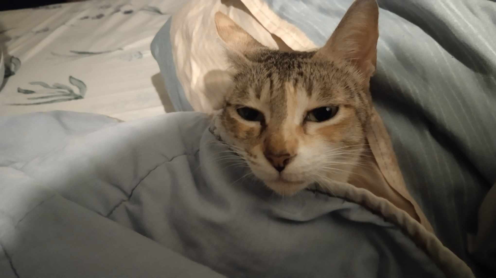

# 🌱 Hey, I'm Elijah.

I'm a 3rd year Computer Science 💻 undergraduate studying at the University of the Philippines – Diliman. 

## 🔭 Showcase
> Here are some projects I've worked on! 
- 📈 This [data science project](https://tes-birth-rate.vercel.app) on the relationship between *poverty* and *parenting*.
- 🍙 [WIP] This [SRS flashcard program](https://jgmejilla.github.io/jlpt_practice/) with for learning N5-level Japanese.
- 🧸 A [self-care web application](https://github.com/compsat/bh24-based-template) made for a Hackathon. 

## 📫 Platforms
> Connect with me!
- 📧 Email: jgmejilla@up.edu.ph

## 🐈‍⬛ Cat
> Here is a picture of my cat.

Her name is Blorange :-)
